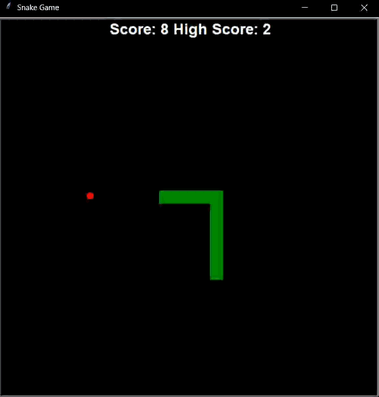

# Snake Game in Python


A classic Snake game built in Python using the turtle module, featuring OOP structure, smooth controls, and sound effects with pygame.

This version includes improvements for a better gameplay experience:

- Smooth snake movement
- Tail growth when eating food
- Collision detection with walls and self
- Sound effects for eating and game over
- Live score tracking with persistent high score
- Menu system for start, pause, and game over screens

## Features
- Playable with keyboard arrow keys
- Pause and resume functionality
- Restart after game over
- Persistent high score saved in `data.txt`
- Sound effects for eating and game over
- Menu system for easy navigation

## Controls
- **Arrow Keys:** Move the snake (Up, Down, Left, Right)
- **Return:** Start game from menu
- **P:** Pause / Resume game
- **N:** Restart game after game over
- **M:** Go back to main menu

## How to Run
1. Clone the repository:
    ```bash
    git clone https://github.com/legophil101/Snake-Game.git
    ```

2. Navigate to the project folder:
    ```bash
    cd snake_game
    ```

3. Install dependencies:
    ```bash
    pip install pygame
    ```

4. Run the game:
    ```bash
    python main.py
    ```
